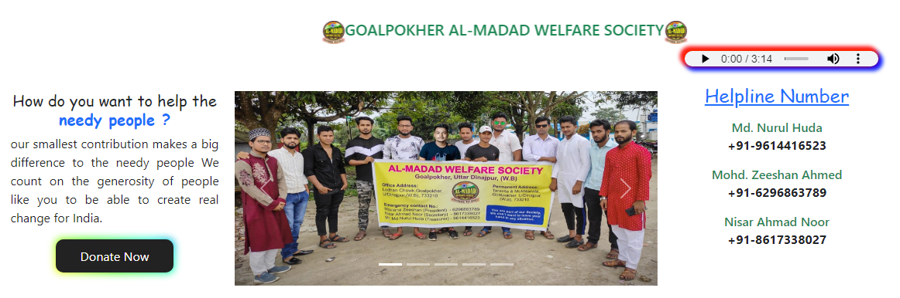

# Hi, I'm Nawaz Danish! 👋

## 🚀 About Me
I'm a full-stack Web developer with hands on experience in MongoDB, Express, React, and Node

## 🔗 Links

## 🛠 Tech Stack Used
- Client: Vite+React, Bootstrap, CSS

## Features

- Light/dark mode toggle (hidden feature)
- Full Responsive User Interface
- Gallary
- Image slider
- Google Map Location
- Donate Now button with popup details
## Screenshots

## Feedback

If you have any feedback, please reach out to us at contact.to.nd@gmail.com

## Developed By:

